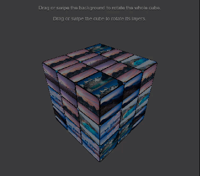

## Webbased rubic with background images

1. Images are in the directory *img*.
2. The image-path must be set in the <code>js/rubik.js</code> in the method <code>Rubik.prototype._build</code>.
See example below: 
```
Rubik.prototype._build = function() {
	for (var z=0;z<Rubik.SIZE;z++) {
		for (var y=0;y<Rubik.SIZE;y++) {
			for (var x=0;x<Rubik.SIZE;x++) {
				var cube = new Cube([x, y, z]);
				this._cubes.push(cube);
				//set image path as third argument
				if (z == 0) { cube.setFace(Face.FRONT, "#ffffff", "img/10.jpg"); }
				if (z == 2) { cube.setFace(Face.BACK, "blue", "img/11.jpg"); }

				if (x == 0) { cube.setFace(Face.LEFT, "green", "img/13.jpg"); }
				if (x == 2) { cube.setFace(Face.RIGHT, "yellow", "img/29.jpg"); }

				if (y == 0) { cube.setFace(Face.TOP, "cyan","img/48.jpg"); }
				if (y == 2) { cube.setFace(Face.BOTTOM, "teal", "img/49.jpg"); }

				// cube.complete();

				this._node.appendChild(cube.getNode());
			}
		}
	}
}

```

And here the corresponding animation as sample.




Regards
Daniel G.
